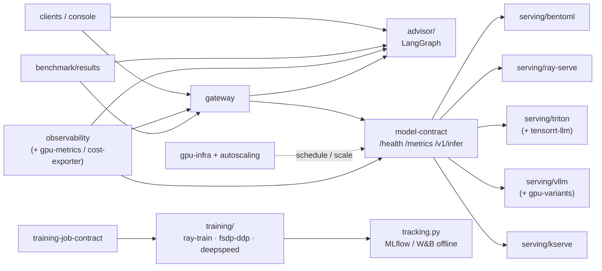

# Vulcan

[](https://github.com/hamidmatiny/Vulcan/actions/workflows/ci.yml)
[](./LICENSE)
[](./.github/workflows/ci.yml)

**Vulcan** is a production-shaped multi-backend model-serving **and training** platform — sibling project to [Argus](https://github.com/hamidmatiny/Argus). One serving contract, many runtimes (BentoML, Ray Serve, Triton, vLLM, KServe); distributed training / LoRA; MLflow + W&B tracking; DVC; and a tool-grounded LangGraph advisor — with GPU infra validated in CI and applied only out-of-band.

**Docs:** `make docs-serve` (MkDocs) · [DEMO](./docs/DEMO_SCRIPT.md) · [Case study](./docs/CASE_STUDY.md) · [Known gaps](./docs/KNOWN_GAPS.md) · [ADRs](./docs/adr/) · [CHANGELOG](./CHANGELOG.md)

**Release state:** tagged **[v1.0.0](https://github.com/hamidmatiny/Vulcan/releases/tag/v1.0.0)** (phase-15). Phases **16–22** (the full v1.1.0 + v1.2.0 tracks: advanced GPU packaging, cost-per-token, training backends, LoRA/PEFT, DVC, experiment tracking, LangGraph advisor) are **complete on `main` as of [`3be5aef`](https://github.com/hamidmatiny/Vulcan/commit/3be5aef)** — `CHANGELOG.md` records **`[1.2.0]`**. No `v1.1.0` or `v1.2.0` Git tag has been cut yet.

| ADR | Decision |
|-----|----------|
| [ADR-001](./docs/adr/001-unified-model-serving-contract.md) | Unified model serving contract (not per-backend APIs) |
| [ADR-002](./docs/adr/002-gpu-cost-safety-policy.md) | GPU cost-safety policy — no real GPUs in CI |
| [ADR-003](./docs/adr/003-mig-partitioning-strategy.md) | MIG partitioning strategy (many-small vs large-batch) |
| [ADR-004](./docs/adr/004-multi-tenant-gpu-scheduling-with-kueue.md) | Multi-tenant GPU scheduling with Kueue |
| [ADR-005](./docs/adr/005-spot-gpu-strategy.md) | Spot GPU strategy (cost, checkpoint contract, workload fit) |
| [ADR-006](./docs/adr/006-routing-policy.md) | Routing policy (benchmark-driven selection + fallback) |
| [ADR-007](./docs/adr/007-advanced-gpu-serving-techniques-scope.md) | Advanced GPU serving scope — GPTQ/AWQ/FP8 packs, speculative decoding docs, TensorRT-LLM templates; validate-only in CI (no invented tokens/s) |
| [ADR-008](./docs/adr/008-self-hosted-cost-per-token-assumptions.md) | Self-hosted cost-per-token — `$/GPU-hour` assumptions for phase-7 instance types × benchmark throughput; labeled assumptions, not invoices |
| [ADR-009](./docs/adr/009-gpu-cost-safety-extends-to-training.md) | GPU cost-safety extends to training — CI uses CPU `gloo` world_size=2 only; no invented GPU throughput |
| [ADR-010](./docs/adr/010-unified-training-job-contract.md) | Unified training job contract — `TrainingJobSpec` / `TrainingJobResult` for Ray Train, FSDP/DDP, DeepSpeed |
| [ADR-011](./docs/adr/011-lora-peft-adapter-serving-integration.md) | LoRA / PEFT — fine-tune job type + BentoML base+adapter via unchanged `/v1/infer`; structural verify, no adapter hash pins |
| [ADR-012](./docs/adr/012-data-versioning-with-dvc.md) | DVC for deterministic model exports — local remote in CI; MANIFEST cross-check; never track training/adapters by hash |
| [ADR-013](./docs/adr/013-pluggable-experiment-tracking.md) | Pluggable experiment tracking — MLflow self-hosted (:9014) + W&B offline-only (moto-style; no wandb.ai in CI) |
| [ADR-014](./docs/adr/014-langgraph-advisor-non-fabrication-scope.md) | LangGraph advisor — tool-grounded recommendations only; non-fabrication extends ADR-007; pinned local LLM, no paid API in CI |

Managed training/hosting comparison: [`pipelines/sagemaker/`](./pipelines/sagemaker/) (moto in CI; [manual runbook](./docs/runbooks/sagemaker-manual-run.md)).

Bedrock as a selectable LLM backend: [`bedrock-gateway/`](./bedrock-gateway/) (thin adapter; moto in CI; optional `:9006`).

Training→serving loop: [`pipelines/kubeflow/`](./pipelines/kubeflow/) (KFP + Training Operator composing Kueue/Karpenter/checkpointing → KServe; [runbook](./docs/runbooks/kubeflow-local-kind.md)).

Routing gateway: [`gateway/`](./gateway/) on **:9007** (ADR-006; recorded benchmarks + Bedrock pricing; explainable fallback).

Observability: [`observability/`](./observability/) — Prometheus **:9008**, Grafana **:9009**, Tempo **:9010** (`make up-observability`). Phase-17 adds **cost-per-token** panels (Bedrock pricing-reference + ADR-008 `$/GPU-hour` math) and GPU utilization via real DCGM Helm under [`observability/gpu-metrics/`](./observability/gpu-metrics/) for phase-7 pools, with a **LIVE-SYNTHETIC** DCGM-shaped exporter for compose/CI. Phase-18 adds **`$/training-step`** from `training/results/` × the same assumptions file.

Training (phase-18/19/21): [`training/`](./training/) — Ray Train, FSDP/DDP, and DeepSpeed behind [`contracts/training-job-contract/`](./contracts/training-job-contract/) (ADR-010). LoRA/PEFT fine-tune under [`training/fsdp-ddp/lora/`](./training/fsdp-ddp/lora/) with BentoML `reference-tiny-llm-lora-demo` serving (ADR-011). Experiment tracking via [`training/common/tracking.py`](./training/common/tracking.py) (ADR-013; `VULCAN_TRACKER_BACKEND=none|mlflow|wandb`). CI runs CPU only (ADR-009); optional status HTTP on **:9011–:9013** and MLflow on **:9014** (`docker compose --profile training up`).

Advisor (phase-22 / v1.2.0 close-out): [`advisor/`](./advisor/) — LangGraph tool-grounded routing/cost advisor (ADR-014). Tools query live Prometheus, `benchmark/results/*.json`, and gateway `routing`; CI asserts every number in the answer appears in that run’s tool evidence. No hosted LLM in CI.

Advanced GPU serving (phase-16): [`serving/vllm/gpu-variants/`](./serving/vllm/gpu-variants/) (GPTQ/AWQ/FP8 resource manifests) and [`serving/triton/tensorrt-llm/`](./serving/triton/tensorrt-llm/) (TensorRT-LLM `config.pbtxt` + Dockerfile + [runbook](./docs/runbooks/tensorrt-llm-build.md)) — schema/`config.pbtxt` lint in CI only; no GPU build or invented throughput ([ADR-007](./docs/adr/007-advanced-gpu-serving-techniques-scope.md)).

---

## Architecture (north star)



Full design: [ARCHITECTURE.md](./ARCHITECTURE.md)

---

## Quick start

```bash
git clone https://github.com/hamidmatiny/Vulcan.git && cd Vulcan
cp .env.example .env
make models-export      # once — pin-identical GPT-2 + ResNet-18 weights
make up                 # :9000 bentoml · :9002 ray-serve · :9003 triton · :9004 vllm
make test
curl -s localhost:9004/health
VULCAN_BACKEND_URL=http://127.0.0.1:9004 VULCAN_CONFORMANCE_MODALITIES=llm make test-serving-common
make benchmark-vllm       # → benchmark/results/vllm-cpu.json
make down
```

**Ports:** Vulcan owns **9000–9099** on the host (avoids Argus and other stacks).  
Pinned models: [`models/MANIFEST.md`](./models/MANIFEST.md) · [BentoML](./serving/bentoml/) · [Ray Serve](./serving/ray-serve/) · [Triton](./serving/triton/) · [vLLM](./serving/vllm/) (LLM-only) · Conformance: [`serving/common/`](./serving/common/)

> **GPU policy:** CI and `make up` never provision real GPUs. Manual GPU benchmarks live in [`docs/benchmarks/`](./docs/benchmarks/) ([ADR-002](./docs/adr/002-gpu-cost-safety-policy.md)).

---

## Repository layout

```text
contracts/model-contract/     OpenAPI + JSON Schema (platform contract)
serving/{common,bentoml,ray-serve,triton,vllm,kserve}/
  vllm/gpu-variants/          GPTQ / AWQ / FP8 resource manifests (phase-16)
  triton/tensorrt-llm/        TensorRT-LLM template + Dockerfile (phase-16)
gateway/                      Benchmark-driven routing (:9007)
advisor/                      LangGraph tool-grounded advisor (ADR-014)
benchmark/                    Harnesses (CPU local; GPU manual)
gpu-infra/{gpu-operator,mig,kueue}/
autoscaling/{karpenter,checkpointing}/
pipelines/{kubeflow,sagemaker}/
bedrock-gateway/
infra/{terraform,helm,argocd}/
observability/                Prometheus / Grafana / Tempo / OTel
  cost-exporter/              Routing cost + cost-per-token (ADR-006/008)
  gpu-metrics/                Real DCGM Helm/scrape + synthetic-dcgm
console/  models/
docs/{adr,benchmarks,runbooks}/  tests/e2e/
```

---

## Engineering bar

- **Commits:** `phase-N: <summary>` or `fix(<component>): <summary>` only
- **ADRs** for architectural decisions under `docs/adr/`
- **README per component**
- **CI from day one** — lint, tests, ADR gate for `contracts/`, `gpu-infra/`, advanced GPU paths, and cost/GPU-metrics assumptions
- **≥ 65% coverage** on gated packages
- **Cursor rules** in [`.cursor/rules/`](./.cursor/rules/) enforce contract-first + CPU-fallback automatically
