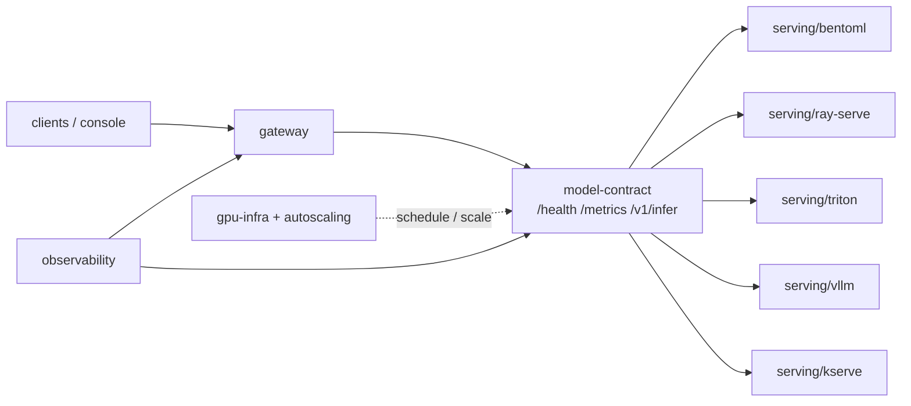

# Vulcan

[](https://github.com/hamidmatiny/Vulcan/actions/workflows/ci.yml)
[](./LICENSE)
[](./.github/workflows/ci.yml)

**Vulcan** is a production-shaped multi-backend model-serving and GPU-orchestration platform — sibling project to [Argus](https://github.com/hamidmatiny/Argus). One serving contract, many runtimes (BentoML, Ray Serve, Triton, vLLM, KServe), with GPU infra that is validated in CI and applied only out-of-band.

**Docs:** [ARCHITECTURE.md](./ARCHITECTURE.md) · [ADRs](./docs/adr/) · [CONTRIBUTING.md](./CONTRIBUTING.md) · [Benchmarks (manual)](./docs/benchmarks/) · [CHANGELOG](./CHANGELOG.md)

| ADR | Decision |
|-----|----------|
| [ADR-001](./docs/adr/001-unified-model-serving-contract.md) | Unified model serving contract (not per-backend APIs) |
| [ADR-002](./docs/adr/002-gpu-cost-safety-policy.md) | GPU cost-safety policy — no real GPUs in CI |
| [ADR-003](./docs/adr/003-mig-partitioning-strategy.md) | MIG partitioning strategy (many-small vs large-batch) |
| [ADR-004](./docs/adr/004-multi-tenant-gpu-scheduling-with-kueue.md) | Multi-tenant GPU scheduling with Kueue |
| [ADR-005](./docs/adr/005-spot-gpu-strategy.md) | Spot GPU strategy (cost, checkpoint contract, workload fit) |
| [ADR-006](./docs/adr/006-routing-policy.md) | Routing policy (benchmark-driven selection + fallback) |

Managed training/hosting comparison: [`pipelines/sagemaker/`](./pipelines/sagemaker/) (moto in CI; [manual runbook](./docs/runbooks/sagemaker-manual-run.md)).

Bedrock as a selectable LLM backend: [`bedrock-gateway/`](./bedrock-gateway/) (thin adapter; moto in CI; optional `:9006`).

Training→serving loop: [`pipelines/kubeflow/`](./pipelines/kubeflow/) (KFP + Training Operator composing Kueue/Karpenter/checkpointing → KServe; [runbook](./docs/runbooks/kubeflow-local-kind.md)).

Routing gateway: [`gateway/`](./gateway/) on **:9007** (ADR-006; recorded benchmarks + Bedrock pricing; explainable fallback).

Observability: [`observability/`](./observability/) — Prometheus **:9008**, Grafana **:9009**, Tempo **:9010** (`make up-observability`).

---

## Architecture (north star)



Full design: [ARCHITECTURE.md](./ARCHITECTURE.md)

---

## Quick start

```bash
git clone https://github.com/hamidmatiny/Vulcan.git && cd Vulcan
cp .env.example .env
make models-export      # once — pin-identical GPT-2 + ResNet-18 weights
make up                 # :9000 bentoml · :9002 ray-serve · :9003 triton · :9004 vllm
make test
curl -s localhost:9004/health
VULCAN_BACKEND_URL=http://127.0.0.1:9004 VULCAN_CONFORMANCE_MODALITIES=llm make test-serving-common
make benchmark-vllm       # → benchmark/results/vllm-cpu.json
make down
```

**Ports:** Vulcan owns **9000–9099** on the host (avoids Argus and other stacks).  
Pinned models: [`models/MANIFEST.md`](./models/MANIFEST.md) · [BentoML](./serving/bentoml/) · [Ray Serve](./serving/ray-serve/) · [Triton](./serving/triton/) · [vLLM](./serving/vllm/) (LLM-only) · Conformance: [`serving/common/`](./serving/common/)

> **GPU policy:** CI and `make up` never provision real GPUs. Manual GPU benchmarks live in [`docs/benchmarks/`](./docs/benchmarks/) ([ADR-002](./docs/adr/002-gpu-cost-safety-policy.md)).

---

## Repository layout

```text
contracts/model-contract/     OpenAPI + JSON Schema (platform contract)
serving/{common,bentoml,...}/ Contract-compliant backends
gateway/                      North-south API surface
benchmark/                    Harnesses (CPU local; GPU manual)
gpu-infra/{gpu-operator,mig,kueue}/
autoscaling/{karpenter,checkpointing}/
pipelines/{kubeflow,sagemaker}/
bedrock-gateway/
infra/{terraform,helm,argocd}/
observability/  console/  models/
docs/{adr,benchmarks}/  tests/e2e/
```

---

## Engineering bar

- **Commits:** `phase-N: <summary>` or `fix(<component>): <summary>` only
- **ADRs** for architectural decisions under `docs/adr/`
- **README per component**
- **CI from day one** — lint, tests, ADR gate for `contracts/` + `gpu-infra/`
- **≥ 65% coverage** on gated packages
- **Cursor rules** in [`.cursor/rules/`](./.cursor/rules/) enforce contract-first + CPU-fallback automatically

Phase 8 status: serving adapters + KServe + GPU Operator/MIG + EKS Terraform + Kueue multi-tenant queues (validate-only in CI).
